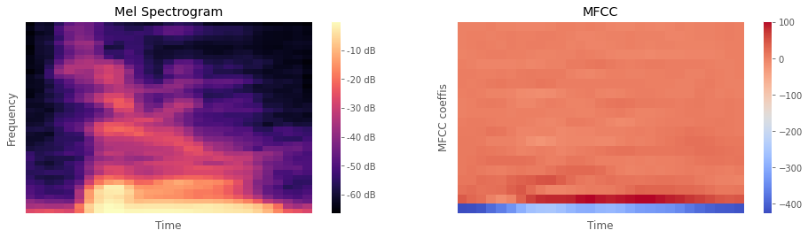
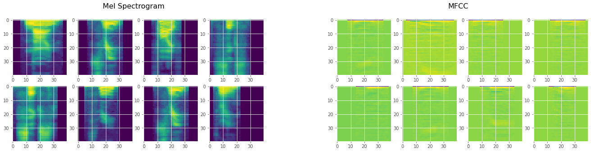
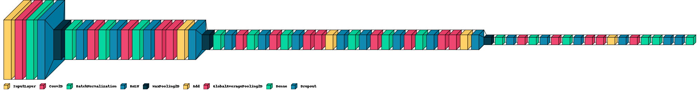

# [Aduio MNIST](https://dacon.io/competitions/official/235905/overview/description)
  - [분석 목표 및 결과](#분석-목표-및-결과)
  - [학습 데이터](#학습-데이터)
  - [EDA](#eda)
  - [모델 학습](#모델-학습)
  - [에러 처리](#에러-처리)
  - [회고](#회고)

## 분석 목표 및 결과

- 음성 녹음 데이터를 0부터 9 사이의 숫자 라벨로 분류
- 음성 데이터 학습에 대한 체험을 목적으로 진행
- Mel Spectrogram, MFCC 방식으로 추출한 feature를 각각 ResNet 응용 모델에 학습시키고
결과를 ensemble하여 accuracy를 0.9725까지 향상

---

## 학습 데이터

- [음성 파일 및 라벨 데이터](https://dacon.io/competitions/official/235905/data)
- 음성 파일 이름과 숫자 라벨을 연관시킨 csv 파일과 음성 녹음 데이터가 존재
    
    ```python
    # train/
    249.wav
    sample rate: 20000 , audio shape: (11267,)
    length: 0.56335 secs
    ==========================================
    513.wav
    sample rate: 20000 , audio shape: (12640,)
    length: 0.632 secs
    ==========================================
    507.wav
    sample rate: 20000 , audio shape: (12845,)
    length: 0.64225 secs
    ==========================================
    ```
    

---

## EDA

<aside>
🦻🏻 Mel Spectrogram, MFCC 방식으로 추출한 feature를 이미지 형태로 시각화

- **Mel Spectrogram**: 주파수에 따라 감지 능력이 변하는 달팽이관의 공식을 적용한 spectrogram
- **MFCC**: Mel Spectrogram에 대해 행렬을 압축해서 표현해주는 DCT 연산을 수행
- Mel Spectrogram은 한정적인 도메인에서, MFCC는 일반적인 상황에서 더 좋은 성능



</aside>

<aside>
💨 모델 학습을 위해 짧은 길이의 오디오에 padding을 붙이고 np.array로 변환한 후 랜덤한 데이터 시각화



</aside>

---

## 모델 학습

- ResNet의 ResBlock을 응용하여 모델 생성
    
    
    
- 5-Fold 교차검증을 실시하면서, 각각의 동일한 모델에 Mel Spectrogram, MFCC feature를 학습시켜
서로의 예측값 및 accuracy를 비교
- 두 가지 예측 결과를 ensemble하여 최종적으로 0.9765의 평균 accuracy 달성
    
    
    |  | 1 Fold | 2 Fold | 3 Fold | 4 Fold | 5 Fold |
    | --- | --- | --- | --- | --- | --- |
    | Mel Spectrogram | 0.9500 | 0.9525 | 0.9175 | 0.9600 | 0.9225 |
    | MFCC | 0.9650 | 0.9250 | 0.9550 | 0.9300 | 0.9575 |
    | Ensemble | 0.9875 | 0.9675 | 0.9750 | 0.9775 | 0.9750 |

---

## 에러 처리

❗ 음성 파일 처리를 위한 Librosa 라이브러리의 의존성인 SoundFile 라이브러리와 관련된 에러 발생
> `tried: '.../site-packages/_soundfile_data/libsndfile.dylib' (no such file)`

🔧 [해당 이슈](https://github.com/bastibe/python-soundfile/issues/310#issuecomment-1024233084)를 참조하여 다운로드받은 `libsndfile.dylib` 파일을 직접 해당 경로에 복사

</aside>

</aside>

---

## 회고

- 베이스라인과 다른 분이 올려준 코드 공유를 많이 참고하다보니 자신만의 분석을 해볼 수 없어 아쉬움
- 음성 데이터 분석 과정을 체험하는 좋은 기회가 되었으며,
다른 음성 데이터에 이번에 배운 분석 방식을 적용해보고 싶은 기대감을 가짐